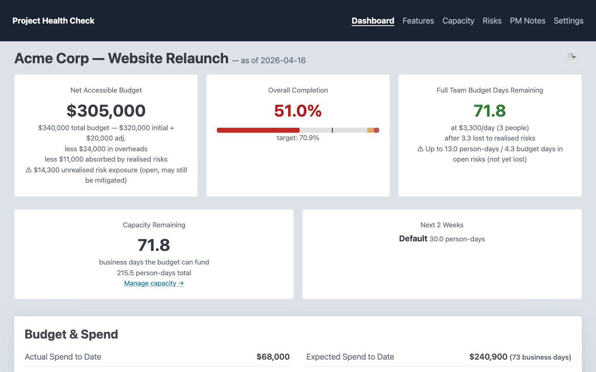
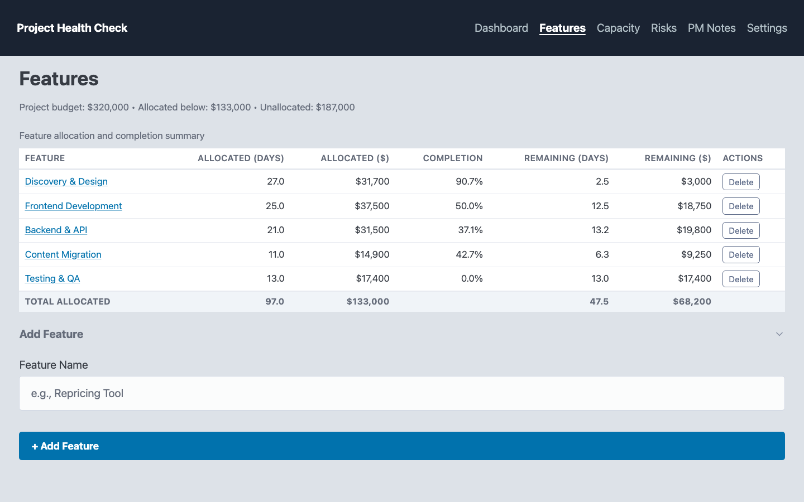
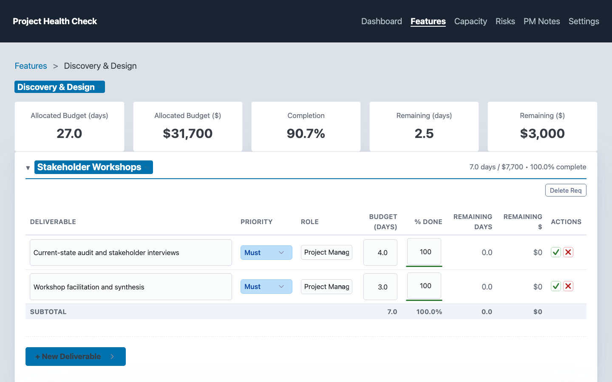
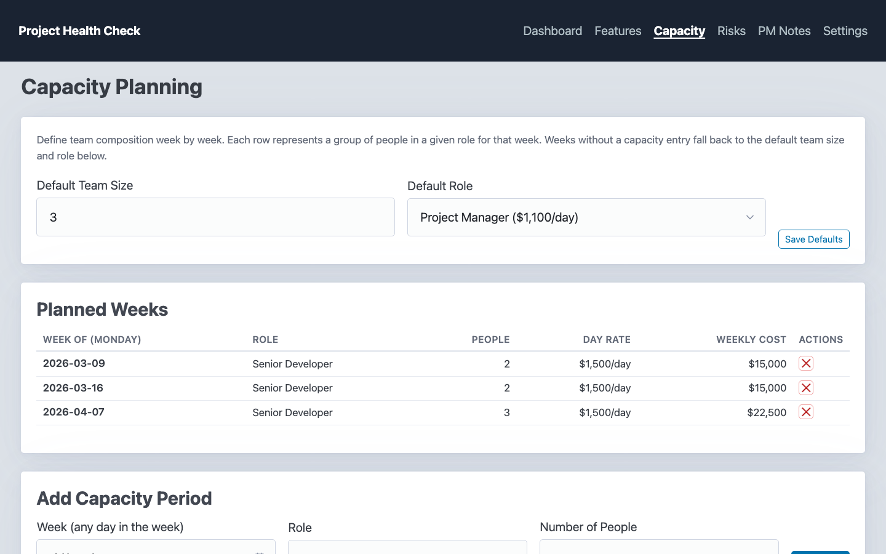
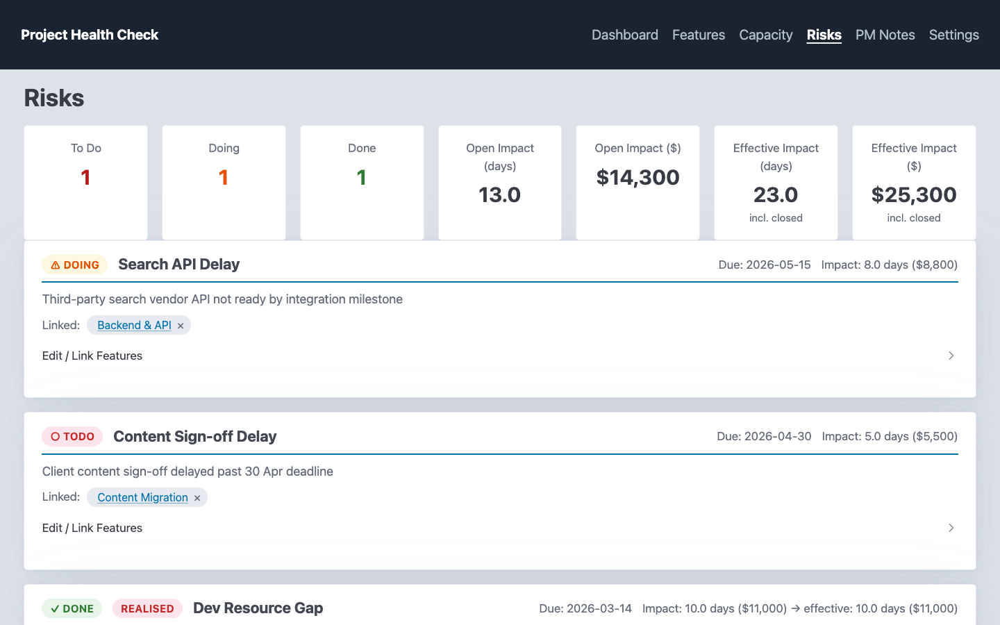
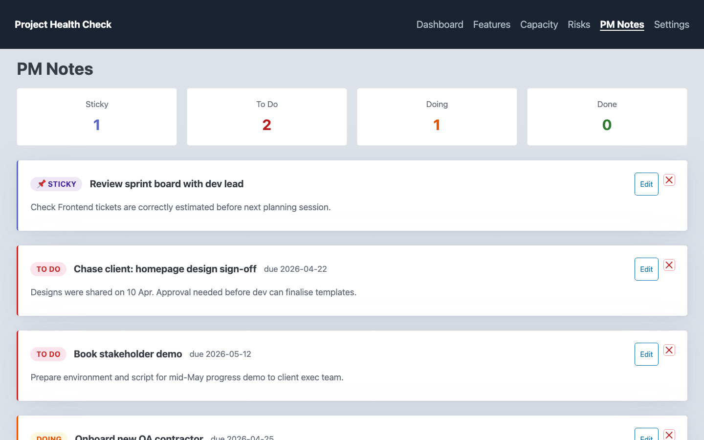
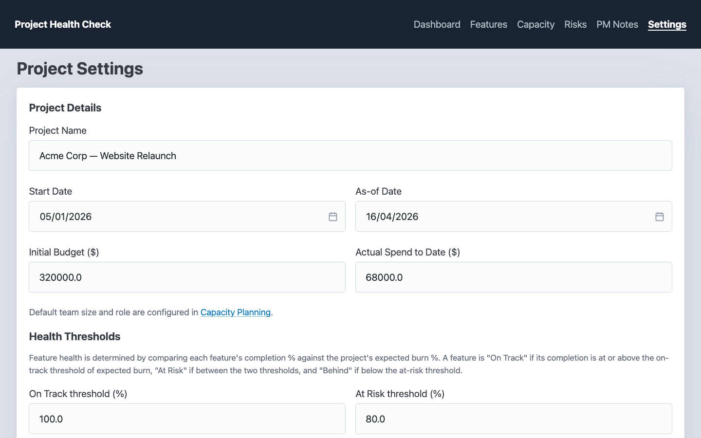

# Project Health Check

**One live view of your project's budget, delivery, risks, and notes — no spreadsheet required.**



> **Dashboard** — your live executive summary, fed automatically by every other tab.

---

## What is Project Health Check?

Project Health Check is a lightweight web app built for project managers who want a single, always-up-to-date picture of how their project is tracking. You enter your budget, team, features, and risks once, then update completion percentages as work progresses. The Dashboard does the rest — calculating burn rate, flagging features that are falling behind, and surfacing anything that needs your attention today.

No formulas to maintain. No pivot tables. Just open your browser and see where things stand.

---

## The Tabs at a Glance

Each tab feeds a different piece of the Dashboard puzzle. You enter data across the tabs; the Dashboard assembles the picture automatically.

---

### Features



Define the top-level work areas of your project — each with its own budget allocation in days and dollars. The completion column rolls up live from the deliverables you track inside each feature, so you always know which areas are on track and which are lagging. The Dashboard uses these numbers to colour-code each feature green, amber, or red.

---

### Feature Detail



Click any feature to drill into its requirements and individual deliverables. Each deliverable has a budget (in days), a role, a priority level, and a **% Done** field. Updating completion here is the only input the Dashboard needs to recalculate health — no formulas to touch.

---

### Capacity Planning



Record your team's size and composition week by week. The Dashboard uses your default role's day rate and the current week's headcount to calculate your daily burn rate and how many budget days remain. When someone joins or goes on leave, add an override for that week and the numbers update immediately.

---

### Risks



Log every risk with its potential impact in days and dollars. Risks flow to the Dashboard in two ways: **open** risks appear as a warning overlay on the budget cards (your worst-case exposure), while **realised** risks (closed and confirmed) have their impact permanently deducted from your accessible budget. The kanban-style To Do / Doing / Done columns let you track mitigation progress at a glance.

---

### PM Notes



Capture reminders, action items, and anything you need to stay on top of. Notes can be flagged **Sticky** or given a due date — either condition causes them to surface automatically on the Dashboard. If more than three notes are due in the next two weeks, the Dashboard shows a count badge so nothing gets buried in a long list.

---

### Settings



Configure your project name, start date, initial budget, team defaults, and day rates. This is also where you set the health thresholds that determine when a feature turns amber or red, record fixed overhead costs, and export or import all your project data as JSON.

---

## How the Tabs Feed the Dashboard

The Dashboard is a read-only summary — you never type directly into it. Everything it shows is calculated live from the data you enter across the other tabs.

**Features drive the health traffic lights.** For each feature, the Dashboard compares how much of the budget has been spent against how much of the work is complete. Features that are burning budget faster than they're delivering turn amber or red. Green means on track.

**Capacity Planning drives burn rate and days remaining.** The app uses your team size and the day rate of your default role to calculate how much budget is consumed each working day. If your team changes in a given week — someone joins, someone goes on leave — you record that in Capacity Planning and the Dashboard adjusts automatically.

**Risks adjust your accessible budget.** A risk that has been closed and realised (it actually happened) has its impact deducted from your remaining budget on the Dashboard. Risks that are still open show as a warning overlay on the progress bars, so you can see your worst-case exposure at a glance.

**PM Notes surface what's urgent.** Any note marked Sticky, or any note with a due date in the next two weeks, appears as a card on the Dashboard. If there are more than three, the Dashboard shows a count so nothing gets buried.

---

## Getting Started on a Mac

These instructions are written for someone who has not used the command line before. Follow each step in order and you will have the app running in under five minutes.

### Step 1 — Open Terminal

Press **Cmd + Space** to open Spotlight Search, type **Terminal**, and press **Enter**. A window with a blinking cursor will appear — this is the command prompt, where you type instructions for your Mac.

### Step 2 — Check that Python 3 is installed

Click inside the Terminal window, paste the following, and press **Enter**:

```
python3 --version
```

If you see a version number starting with 3 (for example, `Python 3.11.4`), you are ready for the next step.

If you see an error message instead, you need to install Python 3. Go to **https://www.python.org/downloads/** in your browser, click the big yellow download button, and run the installer. Accept all defaults. Then come back here.

### Step 3 — Navigate to the project folder

Type `cd ` (the letters c and d, then a space) in the Terminal window — **do not press Enter yet**. Now open **Finder**, locate the **Health_Check** folder, and drag it into the Terminal window. The folder's path will appear automatically after your `cd `. Now press **Enter**.

### Step 4 — Install dependencies (one-time only)

Paste the following and press **Enter**:

```
pip3 install -r requirements.txt
```

You will see a series of lines appear as the app's libraries are downloaded. Wait until the cursor returns and you see no error in red. You only need to do this once — skip this step on future startups.

> If you see `command not found: pip3`, try `pip install -r requirements.txt` instead.

### Step 5 — Start the app

Paste the following and press **Enter**:

```
uvicorn main:app --reload
```

When you see the line `Application startup complete`, the app is running. Open your browser and go to:

**http://127.0.0.1:8000**

The app will stay running as long as the Terminal window is open.

### Step 6 — Stop the app

When you are done, click the Terminal window and press **Ctrl + C** (hold the Control key and press C). The app will shut down.

> **Tip:** Next time you want to start the app, just open Terminal, repeat Step 3 to navigate to the folder, then run Step 5. You do not need to reinstall dependencies again.

---

## First-Time Project Setup

Once the app is open in your browser, follow these steps to get your project configured:

1. Go to **Settings** and fill in your project name, start date, and initial budget. Add at least one **Role** (for example, "Project Manager") with a day rate — this is used to calculate your daily burn rate.
2. Go to **Features** and add the major work areas of your project (for example, "Design", "Development", "Testing"). These are the top-level buckets that appear on the Dashboard.
3. Click into each feature to open its **Feature Detail** page. Add **Requirements** (what needs to be done) and **Deliverables** under each requirement (the specific tasks), including budget in days and a priority level.
4. As work progresses, return to each feature's detail page and update the **% Complete** on individual deliverables. The Dashboard completion figures update immediately.
5. Visit the **Dashboard** whenever you need a summary — it reflects the current state of everything you have entered.

---

## Key Concepts

- **Roles and day rates** — Each role (e.g. Senior Developer, Business Analyst) has a daily cost. Assign roles to deliverables to track where budget is going. The default role's day rate determines your daily burn.
- **Budget Adjustments** — If your budget changes mid-project, record it in Settings rather than overwriting the original figure. This preserves a history of how the budget evolved.
- **Burn rate** — The amount of budget consumed each working day, calculated as your team size multiplied by the default role's day rate. Adjust this by updating Capacity Planning when your team changes.
- **Health indicators** — Each feature on the Dashboard is colour-coded: green (on track), amber (at risk), or red (behind). The thresholds are configurable in Settings — by default, a feature is "on track" if its completion % matches or exceeds the expected spend %, and "at risk" if it falls within 80% of that target.
- **Accessible budget** — Your remaining budget after deducting realised risk impacts and any fixed overhead costs (such as software licences or a PM retainer) that you have recorded in Settings.
